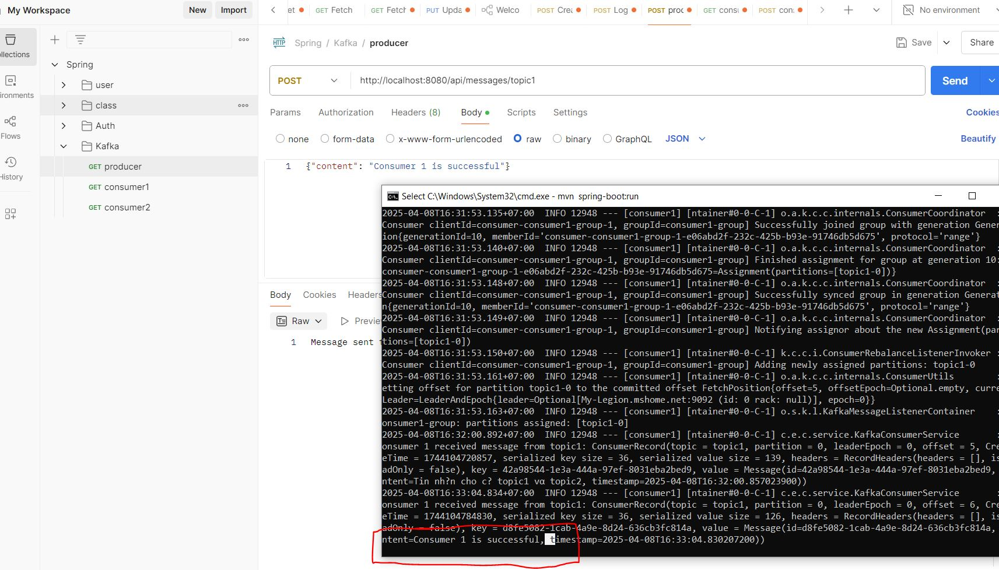

# Bài tập tuần 10
## Ngày học: 08/04/2025
## Bài tập: Kafka Send Message

## 📌 Giới thiệu
Họ và tên: Nguyễn Khắc An\
MSSV: 22024501
## 📌 Cách chạy phía local Zookeeper và Kafka
1️⃣.bin\windows\zookeeper-server-start.bat config\zookeeper.properties
2️⃣.bin\windows\kafka-server-start.bat config\server.properties
## 📌 Kết quả thực hiện
### Ví dụ gửi cho Consumer 1, tương tự cho Consumer 2

